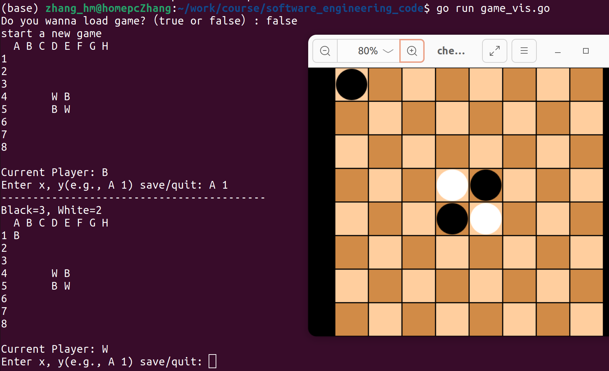
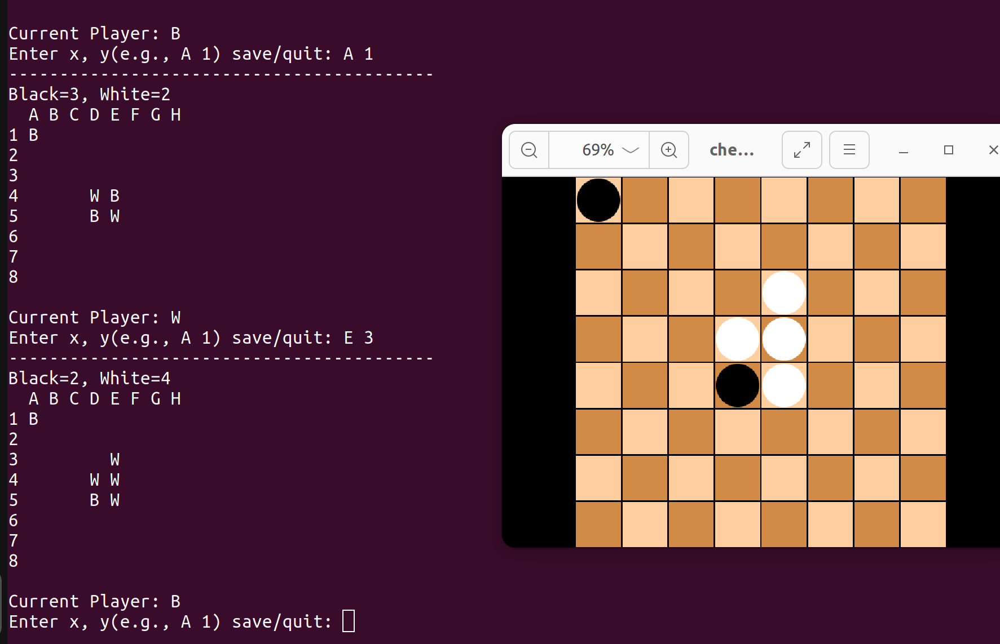
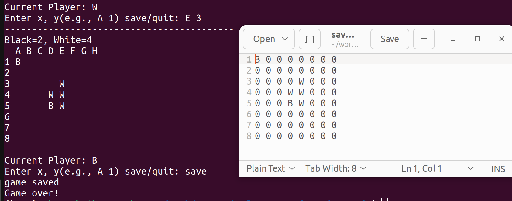
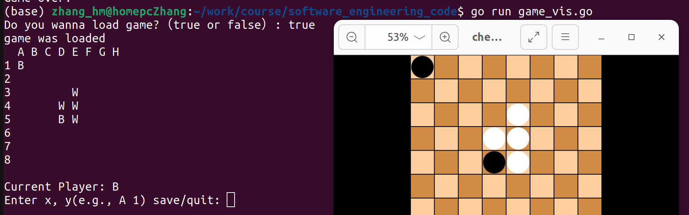

# Introduction
 The purpose of this repository is to preserve the source code from the software engineering course.
 We have developed a chess game with the following features:
 * Basic function
   * Initialize Board
   * Input function
   * Check if Input is vaild
   * Reverse function
   * count function
 * Extra function
   * Board visualize
   * Save and load game

# Tutorials to run the code
Start the game
```
go run game_vis.go
```

Start a new game and input to (A, 1)



Reverse function: Put a white piece to (D, 3) then (D, 4) is reversed 



Save the file to saved_game.txt



load game from saved_game.txt



