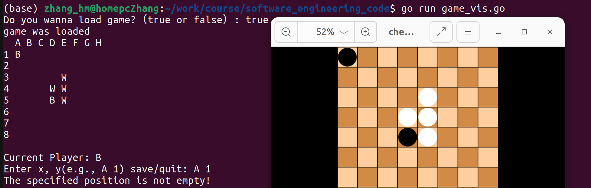

# 1.Introduction
 The purpose of this repository is to preserve the source code from the software engineering course.
 We have developed a chess game with the following features:
## 1.1 Functions
 * Basic function
   * Initialize Board
   * Input function
   * Check if Input is vaild
   * Reverse function
   * count function
 * Extra function
   * Board visualize
   * Save and load game
## 1.2 Directory  description
* img/ --images that used in readme.md file
* jamboard/ --jamboard images week5-week8
* main/ --test code
* game_vis.go game code with board visualization
* game.go game code without board visuailization

## 1.3 Game rules
* The game is played on a 8-by-8 grid of the board
* Players take turns placing their discs on empty squares.
* A player must place their disc in such a way that it "flips" the opponent's discs, turning them
  to their own color.
* A disc can be flipped if it is placed adjacent to an opponent's disc, and there is a straight
  line (horizontal, vertical, or diagonal) between the new disc and another of the player's discs.
* The opponent's discs trapped in between are then flipped to the player's color.
* If a player cannot make a valid move, their turn is forfeited.
* The game ends when the board is full, or neither player can make a move.
* The player with the most discs of their color on the board wins.


# 2.Tutorials to run the code
Start the game
```
go run game_vis.go
```

Start a new game and input to (A, 1)


Reverse function: Put a white piece to (D, 3) then (D, 4) is reversed 


Save the file to saved_game.txt


load game from saved_game.txt


invaild input (put a piece to a not empty place)



